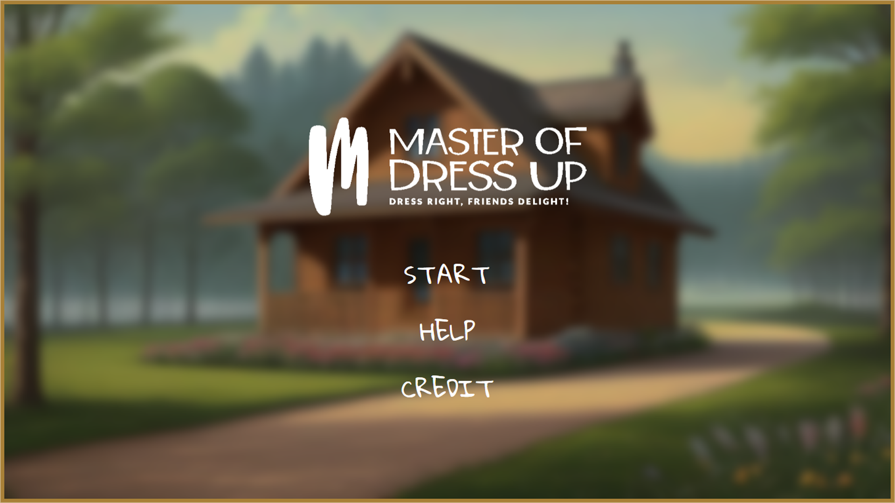
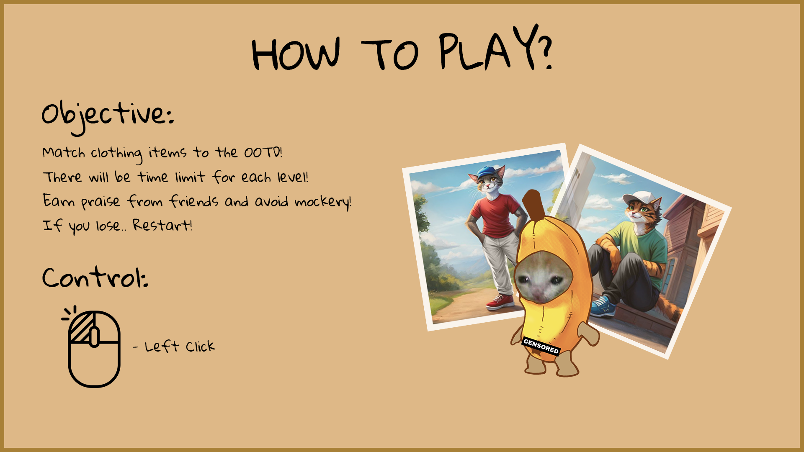
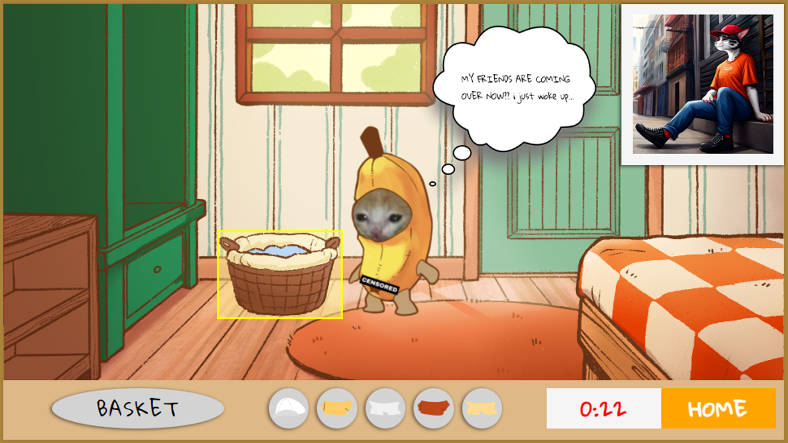
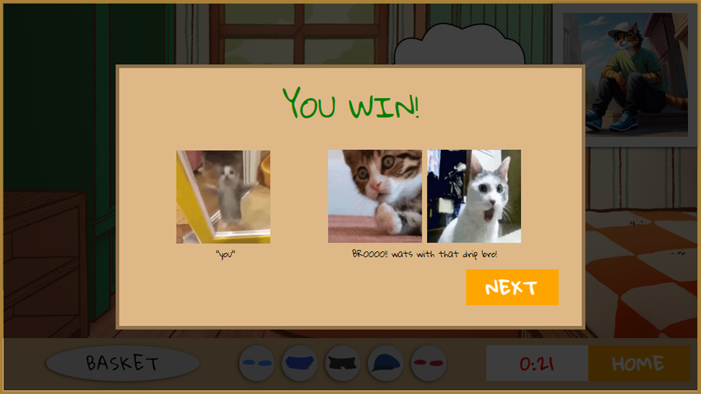

# Master of Dress Up

## About

Master of Dress Up is a fun and engaging browser-based game where players get to wear their outfit of the day in time!  
In this game, players are challenged to match outfits to specific themes within a limited time frame.  
With a variety of clothing options and themes to choose from, players must win the game to win the admiration of their friends.  

## Key Features:

- Dress up your character with various clothing options.
- Race against the clock to match outfits.
- Experience different difficulty levels on the next level.
- Receive praise or get mocking from friends.

## How to Play:

1. Press Start to begin the game.
2. Use the wardrobe to choose clothing items that match the given outfit.
3. Select the clothing for the character to dress them up.
4. Complete the outfit before time runs out to win the round.
5. Impress your friends with your fashion prowess and become the ultimate Master of Dress Up!

## Screenshots:

## Technologies Used:

- Javascript
- HTML & CSS

## Future Enhancement:

### Game enhancement
- Add more furnitures when going into next level
- Add trash into the selections per furniture
- Add transitions when going to game-screen

### Sound enhancement
- Add background music matching the home-screen, stages and win/lose screens.
- Add sound cues when for the win/lose screen characters.
- Add sound cues when pressing buttons & selecting clothes.
- Add sound cues when correct clothing is selected.
- Add sound cues when timer is running out or bonus time added.

## Credits:

Image Assets: 
- My girlfriend 
- icons8.com
- perchance.org
- tenor.com
  
Tech Websites: 
- w3schools.com
- mdn web docs
- github

Thanks:
- My girlfriend 
- Waihon
- Shao Quan
- Classmates of SEIF-17
- Jip Brothers

